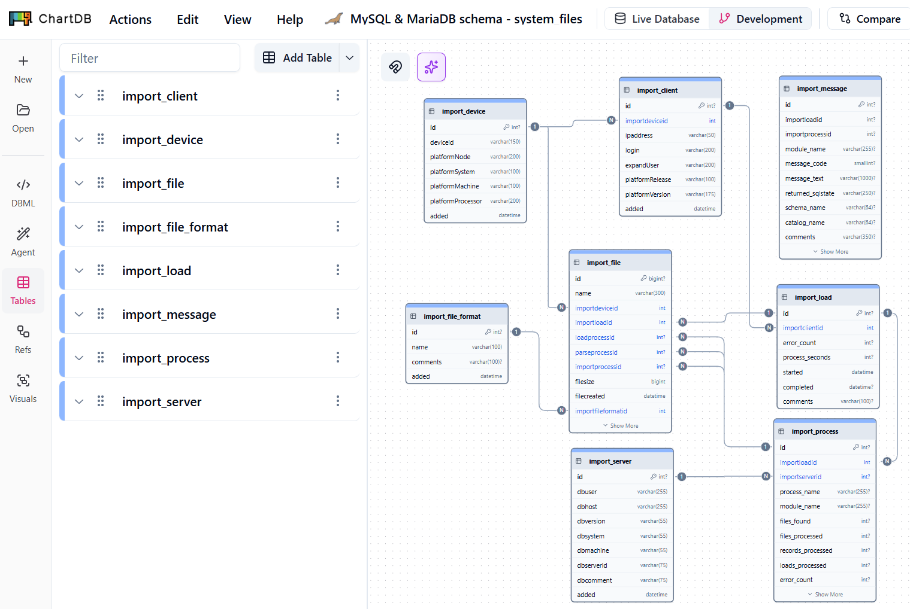

## MySQL or MariaDB database schema for operating system files data analysis

database schema populated by [files-to-mysql](https://github.com/willthefarmer/files-to-mysql)

Additional sub-processes can be added to files-to-mysql import process. MySQL auto-feed configuration in the works. 

## Gathers file definable details on Linux, MacOS and Windows | multi-server ingestion

Same Typescript Node.js Web interface works with mySQL database schema repositories.

## Visual Interface App
in my development queue is [mysql-to-echarts](https://github.com/willthefarmer/mysql-to-echarts) a Web interface.

[mysql-to-echarts](https://github.com/willthefarmer/mysql-to-echarts) is a ***visualization tool*** built with [Express](https://github.com/expressjs/express) web application frameworks and [W2UI](https://github.com/vitmalina/w2ui) drill-down data grids for ***data point details*** while [Apache ECharts](https://github.com/apache/echarts) frameworks is for Data Visualization.
